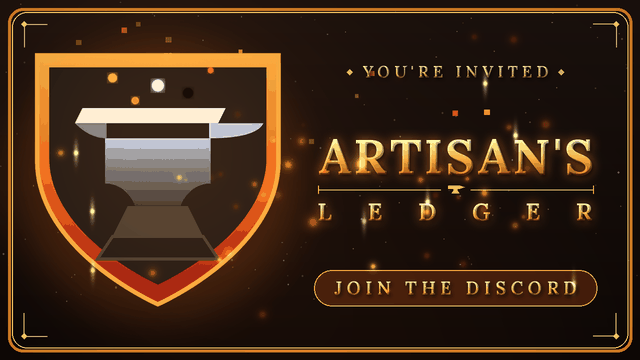

-----

-----
Created using intellectual property belonging to Jagex Limited under the terms of Jagex's Fan Content Policy. This content is not endorsed by or affiliated with Jagex.

RuneScape® is a registered trademark of Jagex Limited. All in-game items, ores, names, and related imagery are the property of Jagex. Artisan's Ledger is an unofficial, fan-made companion tool and is not affiliated with, endorsed, sponsored, or approved by Jagex.

This is a free, non-commercial fan project. Any voluntary contributions support the creator's time and hosting only and do not constitute a sale of Jagex property.

Item and ore icons are sourced from the RuneScape Wiki and used under CC BY-NC-SA 3.0. The RuneScape Wiki is not affiliated with this project.

Artisan's Ledger is Designed by and Copyrighted by GM-Kayaba.
All Rights Reserved.

